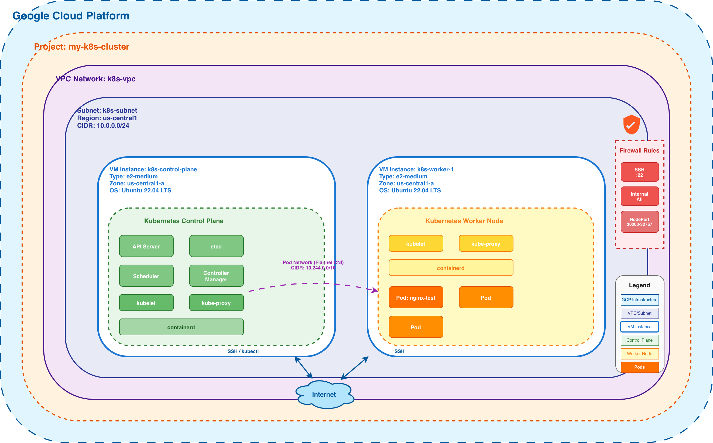

# Building a Kubernetes Cluster on Google Cloud Platform with kubeadm

Ever wondered how Kubernetes clusters actually work under the hood? In this guide, I'll walk you through building your own Kubernetes cluster on Google Cloud Platform from scratch using kubeadm. This hands-on experience will give you a deeper understanding of Kubernetes architecture and help you appreciate what managed services like GKE do behind the scenes.

Whether you're preparing for a certification, building your homelab, or just curious about container orchestration, this step-by-step tutorial has got you covered!

## Architecture Diagram



## What You'll Need

Don't worry—the setup is straightforward! Here's what you'll need before we begin:

- **Google Cloud Account**: You'll need an active GCP account with billing enabled. If you're new to GCP, they offer free credits to get started!
- **gcloud CLI**: The Google Cloud SDK on your local machine ([get it here](https://cloud.google.com/sdk/docs/install))
  - Quick setup: `gcloud auth login` to authenticate
- **Appropriate Permissions**: Your GCP account should be able to:
  - Create and manage projects
  - Spin up Compute Engine instances
  - Configure VPC networks and firewall rules
- **Some Familiarity With**:
  - Basic Linux commands
  - SSH connections
  - Kubernetes fundamentals (though we'll explain as we go!)

## Let's Build This Thing

Ready to get your hands dirty? We'll build this cluster step by step, starting with the infrastructure and working our way up to a fully functioning cluster. I'll explain what each command does and why it matters.

## Step 1: Setting Up Your GCP Project

First things first—let's create a dedicated GCP project for our cluster and make it the active project. Run these commands on your local machine:

```bash
gcloud projects create my-k8s-cluster
gcloud config set project my-k8s-cluster
```

## Step 2: Crafting Your Network Infrastructure

Set up a custom VPC network with regional BGP routing and create a subnet in the us-central1 region. Run these commands on your local machine:

```bash
gcloud compute networks create k8s-vpc \
  --subnet-mode=custom \
  --bgp-routing-mode=regional

gcloud compute networks subnets create k8s-subnet \
  --network=k8s-vpc \
  --range=10.0.0.0/24 \
  --region=us-central1
```

## Step 3: Locking Down Security with Firewall Rules

Configure firewall rules to enable SSH access from anywhere and allow all internal communication between cluster nodes. Run these commands on your local machine:

```bash
gcloud compute firewall-rules create k8s-allow-ssh \
  --network=k8s-vpc \
  --allow=tcp:22 \
  --source-ranges=0.0.0.0/0

gcloud compute firewall-rules create k8s-allow-internal \
  --network=k8s-vpc \
  --allow=tcp,udp,icmp
```

## Step 4: Spinning Up Your Control Plane Node

Provision an e2-medium VM instance running Ubuntu 22.04 LTS to serve as the cluster's control plane. Run this command on your local machine:

```bash
gcloud compute instances create k8s-control-plane \
  --machine-type=e2-medium \
  --subnet=k8s-subnet \
  --image-family=ubuntu-2204-lts \
  --image-project=ubuntu-os-cloud \
  --zone=us-central1-a
```

## Step 5: SSH Into Your Control Plane

Connect to the control plane VM using the `gcloud` CLI. Run this command on your local machine:

```bash
gcloud compute ssh k8s-control-plane --zone=us-central1-a
```

## Step 6: Preparing the Control Plane Environment

Installing `containerd` on Ubuntu for a Kubernetes cluster requires a few specific OS-level tweaks before the actual installation to ensure networking and resource management (cgroups) work correctly.

Here is the step-by-step guide to getting it running. **All commands in this section run on the control plane node.**

## System Configuration Prerequisites

Kubernetes requires specific kernel modules and network settings to allow the container runtime to handle bridged traffic.

**Load Kernel Modules**

Create a configuration file to load the necessary modules on boot (on control plane):

```bash
cat <<EOF | sudo tee /etc/modules-load.d/k8s.conf
overlay
br_netfilter
EOF

sudo modprobe overlay
sudo modprobe br_netfilter
```

**Configure Sysctl**

Enable IP forwarding and bridge networking. The sysctl command applies these changes immediately without requiring a reboot (on control plane):

```bash
cat <<EOF | sudo tee /etc/sysctl.d/k8s.conf
net.bridge.bridge-nf-call-iptables  = 1
net.bridge.bridge-nf-call-ip6tables = 1
net.ipv4.ip_forward                 = 1
EOF

sudo sysctl --system
```

## Installing containerd

You can install `containerd` directly from the official Ubuntu repositories (on control plane):

```bash
sudo apt update
sudo apt install -y containerd
```

## Configuring containerd for Kubernetes

This is the most critical step. By default, `containerd` does not use the **systemd cgroup driver**, which Kubernetes strongly recommends for stability.

**Generate Default Config**

Create the directory and generate a clean configuration file (on control plane):

```bash
sudo mkdir -p /etc/containerd
containerd config default | sudo tee /etc/containerd/config.toml > /dev/null
```

**Enable Systemd Cgroup Driver**

You need to change `SystemdCgroup = false` to `true`. You can do this manually with an editor or use this `sed` command (on control plane):

```bash
sudo sed -i 's/SystemdCgroup = false/SystemdCgroup = true/' /etc/containerd/config.toml
```

**Restart containerd**

Apply the new configuration (on control plane):

```bash
sudo systemctl restart containerd
sudo systemctl enable containerd
```

## Installing kubeadm, kubelet, and kubectl

Add the Kubernetes package repository and install the necessary components. Note that the directory `/etc/apt/keyrings` is typically already present on Ubuntu 22.04 systems. The packages are marked as held to prevent automatic updates (on control plane):

```bash
sudo apt-get update
sudo apt-get install -y apt-transport-https ca-certificates curl gpg

curl -fsSL https://pkgs.k8s.io/core:/stable:/v1.35/deb/Release.key | sudo gpg --dearmor -o /etc/apt/keyrings/kubernetes-apt-keyring.gpg

echo 'deb [signed-by=/etc/apt/keyrings/kubernetes-apt-keyring.gpg] https://pkgs.k8s.io/core:/stable:/v1.35/deb/ /' | sudo tee /etc/apt/sources.list.d/kubernetes.list

sudo apt-get update
sudo apt-get install -y kubelet kubeadm kubectl
sudo apt-mark hold kubelet kubeadm kubectl

sudo systemctl enable --now kubelet
```

## Step 7: Bootstrapping the Kubernetes Control Plane

Bootstrap the Kubernetes control plane with the specified pod network CIDR range (on control plane):

```bash
sudo kubeadm init --pod-network-cidr=10.244.0.0/16
```

Once initialization completes successfully, configure kubectl access for your user account (on control plane):

```bash
mkdir -p $HOME/.kube
sudo cp -i /etc/kubernetes/admin.conf $HOME/.kube/config
sudo chown $(id -u):$(id -g) $HOME/.kube/config
```

The initialization will output a join token for adding worker nodes. While you can save it, generating a fresh token later is straightforward.

## Deploying Your Pod Network Plugin

Deploy Flannel as the CNI (Container Network Interface) plugin to enable pod-to-pod communication throughout the cluster (on control plane):

```bash
kubectl apply -f https://github.com/flannel-io/flannel/releases/latest/download/kube-flannel.yml
```

## Supercharging Your kubectl Experience

Enable kubectl command auto-completion for the current session and persist it for future sessions. The first command activates it immediately, while the second adds it to your bash profile (on control plane):

```bash
source <(kubectl completion bash)
echo "source <(kubectl completion bash)" >> ~/.bashrc
```

Optionally, create a shorthand alias `k` for kubectl with the same completion behavior (on control plane):

```bash
alias k=kubectl
complete -o default -F __start_kubectl k
```

## Step 8: Bringing Worker Nodes Into the Mix

With the control plane ready, provision an additional VM instance that will function as a worker node for running workloads. Run this command on your local machine:

```bash
gcloud compute instances create k8s-worker-1 \
  --machine-type=e2-medium \
  --subnet=k8s-subnet \
  --image-family=ubuntu-2204-lts \
  --image-project=ubuntu-os-cloud \
  --zone=us-central1-a
```

## Step 9: SSH Into Your Worker Node

Connect to the worker node VM using the `gcloud` CLI. Run this command on your local machine:

```bash
gcloud compute ssh k8s-worker-1 --zone=us-central1-a
```

## Step 10: Preparing the Worker Node Environment

**All commands in this section run on the worker node.** Repeat all the installation steps from Step 6 on the worker node: System Configuration Prerequisites, Installing containerd, Configuring containerd for Kubernetes, and Installing kubeadm, kubelet, and kubectl.

## Step 11: Joining Worker to Control Plane

Generate a fresh join command from the control plane (on control plane):

```bash
kubeadm token create --print-join-command
```

Execute the output command on the worker node to register it with the cluster (on worker node).

## Step 12: Taking Your Cluster for a Test Drive

Now that your cluster is fully operational, verify everything is working by deploying a simple nginx web server. **All kubectl commands run on the control plane.**

## Creating and Running an Nginx Pod

Deploy an nginx pod to your cluster (on control plane):

```bash
kubectl run nginx-test --image=nginx:latest --port=80
```

## Verifying the Pod is Running

Check the status of your pod (on control plane):

```bash
kubectl get pods
```

You should see output similar to:

```bash
NAME         READY   STATUS    RESTARTS   AGE
nginx-test   1/1     Running   0          30s
```

## Getting Detailed Pod Information

View more details about the running pod (on control plane):

```bash
kubectl describe pod nginx-test
```

## Exposing the Pod to the World

If you want to access nginx from within the cluster, create a service (on control plane):

```bash
kubectl expose pod nginx-test --type=NodePort --port=80
```

Check the service and assigned port (on control plane):

```bash
kubectl get services nginx-test
```

## Accessing Nginx from Your Computer

To access the nginx server from your local machine, you'll need to open the NodePort in GCP's firewall and get the external IP of one of your nodes.

First, create a firewall rule to allow traffic on NodePort range (30000-32767), run this on your local machine:

```bash
gcloud compute firewall-rules create k8s-allow-nodeport \
  --network=k8s-vpc \
  --allow=tcp:30000-32767 \
  --source-ranges=0.0.0.0/0
```

Get the external IP address of your worker node or control plane (on your local machine):

```bash
gcloud compute instances list --filter="name~'k8s-'"
```

Note the `EXTERNAL_IP` from the output. Now get the NodePort assigned to your service (on control plane):

```bash
kubectl get service nginx-test -o jsonpath='{.spec.ports[0].nodePort}'
```

This will output a port number between 30000-32767. Access nginx by opening your browser to:

```bash
http://EXTERNAL_IP:NODEPORT
```

For example, if your external IP is `34.123.45.67` and NodePort is `31234`, visit:

```bash
http://34.123.45.67:31234
```

You should see the "Welcome to nginx!" page.

## Cleaning Up the Test Resources

Remove the nginx pod and service when you're done testing (on control plane):

```bash
kubectl delete service nginx-test
kubectl delete pod nginx-test
```

If you created the NodePort firewall rule, remove it as well (on your local machine):

```bash
gcloud compute firewall-rules delete k8s-allow-nodeport
```

## Step 13: Tearing Down Your Cluster

Tear down all created resources in reverse order. Start with the VMs, then remove firewall rules, subnet, and VPC. Run these commands on your local machine:

```bash
gcloud compute instances delete k8s-control-plane k8s-worker-1 \
  --zone=us-central1-a

gcloud compute firewall-rules delete k8s-allow-ssh k8s-allow-internal

gcloud compute networks subnets delete k8s-subnet \
  --region=us-central1

gcloud compute networks delete k8s-vpc
```

If you want to remove the entire project and all its contents, run:

```bash
gcloud projects delete my-k8s-cluster
```

## A Word About Production Readiness

Before we wrap up, let's have an honest conversation: **this cluster is perfect for learning and testing, but it's not production-ready**. Think of this as your training ground—a safe space to experiment, break things, and learn!

### Final Thoughts

Congratulations on building your own Kubernetes cluster! You've gained hands-on experience with container orchestration that many developers never get. Use this setup to experiment, test your applications, and deepen your understanding of how Kubernetes really works.

When you're ready for production, you'll appreciate managed services even more—but you'll also understand what's happening behind the scenes. And that knowledge? Invaluable.

Happy clustering! Feel free to reach out if you have questions or want to share your experience. Let's keep learning together!
